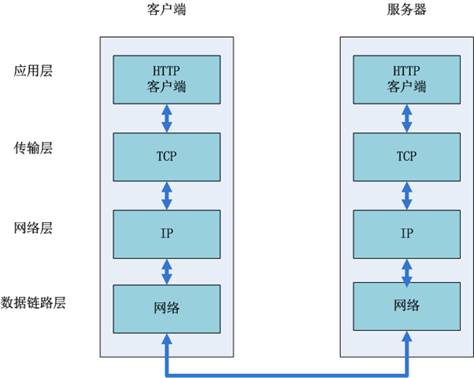
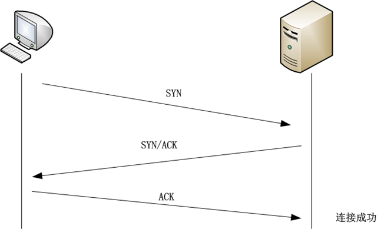

2017 Alloyteam Web 前端大会前端基础总结...

<!-- more -->

# **HTML**

## 常用的 meta 头

```html
<!DOCTYPE html>
<!-- 使用 HTML5 doctype，不区分大小写 -->
<html lang="zh-cmn-Hans">
  <!-- 更加标准的 lang 属性写法 -->
  <head>
    <meta charset="utf-8" />
    <!-- 声明文档使用的字符编码 -->
    <meta http-equiv="X-UA-Compatible" content="IE=edge,chrome=1" />
    <!-- 优先使用 IE 最新版本和 Chrome -->
    <meta name="description" content="不超过150个字符" />
    <!-- 页面描述 -->
    <meta name="keywords" content="" />
    <!-- 页面关键词 -->
    <meta name="author" content="name, email@gmail.com" />
    <!-- 网页作者 -->
    <meta name="robots" content="index,follow" />
    <!-- 搜索引擎抓取 -->

    <!-- 为移动设备添加 viewport -->
    <meta name="viewport" content="initial-scale=1, maximum-scale=3, minimum-scale=1, user-scalable=no" />
    <!-- `width=device-width` 会导致 iPhone 5 添加到主屏后以 WebApp 全屏模式打开页面时出现黑边 http://bigc.at/ios-webapp-viewport-meta.orz -->

    <!-- iOS 设备 begin -->
    <meta name="apple-mobile-web-app-title" content="标题" />
    <!-- 添加到主屏后的标题（iOS 6 新增） -->
    <meta name="apple-mobile-web-app-capable" content="yes" />
    <!-- 是否启用 WebApp 全屏模式 -->
    <meta name="apple-mobile-web-app-status-bar-style" content="black-translucent" />
    <!-- 设置状态栏的背景颜色，只有在 `"apple-mobile-web-app-capable" content="yes"` 时生效 -->
    <meta name="format-detection" content="telephone=no" />
    <!-- 禁止数字识自动别为电话号码 -->
    <meta name="apple-itunes-app" content="app-id=myAppStoreID, affiliate-data=myAffiliateData, app-argument=myURL" />
    <!-- 添加智能 App 广告条 Smart App Banner（iOS 6+ Safari） -->

    <!-- iOS 图标 begin -->
    <link rel="apple-touch-icon-precomposed" href="/apple-touch-icon-57x57-precomposed.png" />
    <!-- iPhone 和 iTouch，默认 57x57 像素，必须有 -->
    <link rel="apple-touch-icon-precomposed" sizes="114x114" href="/apple-touch-icon-114x114-precomposed.png" />
    <!-- Retina iPhone 和 Retina iTouch，114x114 像素，可以没有，但推荐有 -->
    <link rel="apple-touch-icon-precomposed" sizes="144x144" href="/apple-touch-icon-144x144-precomposed.png" />
    <!-- Retina iPad，144x144 像素，可以没有，但推荐有 -->
    <!-- iOS 图标 end -->

    <!-- iOS 启动画面 begin -->
    <link rel="apple-touch-startup-image" sizes="768x1004" href="/splash-screen-768x1004.png" />
    <!-- iPad 竖屏 768 x 1004（标准分辨率） -->
    <link rel="apple-touch-startup-image" sizes="1536x2008" href="/splash-screen-1536x2008.png" />
    <!-- iPad 竖屏 1536x2008（Retina） -->
    <link rel="apple-touch-startup-image" sizes="1024x748" href="/Default-Portrait-1024x748.png" />
    <!-- iPad 横屏 1024x748（标准分辨率） -->
    <link rel="apple-touch-startup-image" sizes="2048x1496" href="/splash-screen-2048x1496.png" />
    <!-- iPad 横屏 2048x1496（Retina） -->

    <link rel="apple-touch-startup-image" href="/splash-screen-320x480.png" />
    <!-- iPhone/iPod Touch 竖屏 320x480 (标准分辨率) -->
    <link rel="apple-touch-startup-image" sizes="640x960" href="/splash-screen-640x960.png" />
    <!-- iPhone/iPod Touch 竖屏 640x960 (Retina) -->
    <link rel="apple-touch-startup-image" sizes="640x1136" href="/splash-screen-640x1136.png" />
    <!-- iPhone 5/iPod Touch 5 竖屏 640x1136 (Retina) -->
    <!-- iOS 启动画面 end -->

    <!-- iOS 设备 end -->
    <meta name="msapplication-TileColor" content="#000" />
    <!-- Windows 8 磁贴颜色 -->
    <meta name="msapplication-TileImage" content="icon.png" />
    <!-- Windows 8 磁贴图标 -->

    <link rel="alternate" type="application/rss+xml" title="RSS" href="/rss.xml" />
    <!-- 添加 RSS 订阅 -->
    <link rel="shortcut icon" type="image/ico" href="/favicon.ico" />
    <!-- 添加 favicon icon -->

    <title>标题</title>
  </head>
</html>
```

### 基本标签

使用 HTML5 doctype，不区分大小写。

```html
<!DOCTYPE html>
<!-- 使用 HTML5 doctype，不区分大小写 -->
```

声明文档使用的字符编码

```html
<meta charset="utf-8" />
<!-- 声明文档使用的字符编码 -->
```

更加标准的 lang 属性写法

- 简体中文

```html
<html lang="zh-cmn-Hans">
  <!-- 更加标准的 lang 属性写法 -->
</html>
```

- 繁体中文

```html
<html lang="zh-cmn-Hant">
  <!-- 更加标准的 lang 属性写法 -->
</html>
```

很少情况才需要加地区代码，通常是为了强调不同地区汉语使用差异，例如：

```html
<p lang="zh-cmn-Hans">
  <strong lang="zh-cmn-Hans-CN">菠萝</strong>和<strong lang="zh-cmn-Hant-TW">鳳梨</strong>其实是同一种水果。只是大陆和台湾称谓不同，且新加坡、马来西亚一带的称谓也是不同的，称之为<strong
    lang="zh-cmn-Hans-SG"
    >黄梨</strong
  >。
</p>
```

优先使用 IE 最新版本和 Chrome

```html
<meta http-equiv="X-UA-Compatible" content="IE=edge,chrome=1" />
<!-- 优先使用 IE 最新版本和 Chrome -->
```

### SEO 优化

页面描述
每个网页都应有一个不超过 150 个字符且能准确反映网页内容的描述标签。

```html
<meta name="description" content="不超过150个字符" />
<!-- 页面描述 -->
```

页面关键词

```html
<meta name="keywords" content="" />
<!-- 页面关键词 -->
```

定义页面标题

```html
<title>标题</title>
```

定义网页作者

```html
<meta name="author" content="name, email@gmail.com" />
<!-- 网页作者 -->
```

定义网页搜索引擎索引方式，robotterms 是一组使用英文逗号「,」分割的值，通常有如下几种取值：none，noindex，nofollow，all，index 和 follow

```html
<meta name="robots" content="index,follow" />
<!-- 搜索引擎抓取 -->
```

### 可选标签

#### 为移动设备添加

```html
<meta name="viewport" content="initial-scale=1, maximum-scale=3, minimum-scale=1, user-scalable=no" />
<!-- `width=device-width` 会导致 iPhone 5 添加到主屏后以 WebApp 全屏模式打开页面时出现黑边 http://bigc.at/ios-webapp-viewport-meta.orz -->
```

content 参数：

- width viewport 宽度(数值/device-width)
- height viewport 高度(数值/device-height)
- initial-scale 初始缩放比例
- maximum-scale 最大缩放比例
- minimum-scale 最小缩放比例
- user-scalable 是否允许用户缩放(yes/no)
- minimal-ui iOS 7.1 beta 2 中新增属性（注意：iOS8 中已经删除），可以在页面加载时最小化上下状态栏。这是一个布尔值，可以直接这样写：
  `<meta name="viewport" content="width=device-width, initial-scale=1, minimal-ui">`

**iOS 设备**
添加到主屏后的标题（iOS 6 新增）

```html
<meta name="apple-mobile-web-app-title" content="标题" />
<!-- 添加到主屏后的标题（iOS 6 新增） -->
```

是否启用 WebApp 全屏模式

```html
<meta name="apple-mobile-web-app-capable" content="yes" />
<!-- 是否启用 WebApp 全屏模式 -->
```

设置状态栏的背景颜色

```html
<meta name="apple-mobile-web-app-status-bar-style" content="black-translucent" />
<!-- 设置状态栏的背景颜色，只有在 `"apple-mobile-web-app-capable" content="yes"` 时生效 -->
```

content 参数：

- default 默认值。
- black 状态栏背景是黑色。
- black-translucent 状态栏背景是黑色半透明。

如果设置为 default 或 black ,网页内容从状态栏底部开始。
如果设置为 black-translucent ,网页内容充满整个屏幕，顶部会被状态栏遮挡。
禁止数字识自动别为电话号码

```html
<meta name="format-detection" content="telephone=no" />
<!-- 禁止数字识自动别为电话号码 -->
```

iOS 图标
rel 参数：
apple-touch-icon 图片自动处理成圆角和高光等效果。
apple-touch-icon-precomposed 禁止系统自动添加效果，直接显示设计原图。
iPhone 和 iTouch，默认 57x57 像素，必须有

```html
<link rel="apple-touch-icon-precomposed" href="/apple-touch-icon-57x57-precomposed.png" />
<!-- iPhone 和 iTouch，默认 57x57 像素，必须有 -->
```

iPad，72x72 像素，可以没有，但推荐有

```html
<link rel="apple-touch-icon-precomposed" sizes="72x72" href="/apple-touch-icon-72x72-precomposed.png" />
<!-- iPad，72x72 像素，可以没有，但推荐有 -->
```

Retina iPhone 和 Retina iTouch，114x114 像素，可以没有，但推荐有

```html
<link rel="apple-touch-icon-precomposed" sizes="114x114" href="/apple-touch-icon-114x114-precomposed.png" />
<!-- Retina iPhone 和 Retina iTouch，114x114 像素，可以没有，但推荐有 -->
```

Retina iPad，144x144 像素，可以没有，但推荐有

```html
<link rel="apple-touch-icon-precomposed" sizes="144x144" href="/apple-touch-icon-144x144-precomposed.png" />
<!-- Retina iPad，144x144 像素，可以没有，但推荐有 -->
```

iOS 启动画面
iPad 的启动画面是不包括状态栏区域的。
iPad 竖屏 768 x 1004（标准分辨率）

```html
<link rel="apple-touch-startup-image" sizes="768x1004" href="/splash-screen-768x1004.png" />
<!-- iPad 竖屏 768 x 1004（标准分辨率） -->
```

iPad 竖屏 1536x2008（Retina）

```html
<link rel="apple-touch-startup-image" sizes="1536x2008" href="/splash-screen-1536x2008.png" />
<!-- iPad 竖屏 1536x2008（Retina） -->
```

iPad 横屏 1024x748（标准分辨率）

```html
<link rel="apple-touch-startup-image" sizes="1024x748" href="/Default-Portrait-1024x748.png" />
<!-- iPad 横屏 1024x748（标准分辨率） -->
```

iPad 横屏 2048x1496（Retina）

```html
<link rel="apple-touch-startup-image" sizes="2048x1496" href="/splash-screen-2048x1496.png" />
<!-- iPad 横屏 2048x1496（Retina） -->
```

iPhone 和 iPod touch 的启动画面是包含状态栏区域的。
iPhone/iPod Touch 竖屏 320x480 (标准分辨率)

```html
<link rel="apple-touch-startup-image" href="/splash-screen-320x480.png" />
<!-- iPhone/iPod Touch 竖屏 320x480 (标准分辨率) -->
```

iPhone/iPod Touch 竖屏 640x960 (Retina)

```html
<link rel="apple-touch-startup-image" sizes="640x960" href="/splash-screen-640x960.png" />
<!-- iPhone/iPod Touch 竖屏 640x960 (Retina) -->
```

iPhone 5/iPod Touch 5 竖屏 640x1136 (Retina)

```html
<link rel="apple-touch-startup-image" sizes="640x1136" href="/splash-screen-640x1136.png" />
<!-- iPhone 5/iPod Touch 5 竖屏 640x1136 (Retina) -->
```

添加智能 App 广告条 Smart App Banner（iOS 6+ Safari）

```html
<meta name="apple-itunes-app" content="app-id=myAppStoreID, affiliate-data=myAffiliateData, app-argument=myURL" />
<!-- 添加智能 App 广告条 Smart App Banner（iOS 6+ Safari） -->
```

### Android

Android Lollipop 中的 Chrome 39 增加 theme-color meta 标签，用来控制选项卡颜色。

```html
<meta name="theme-color" content="#db5945" />
```

### Windows 8

Windows 8 磁贴颜色

```html
<meta name="msapplication-TileColor" content="#000" />
<!-- Windows 8 磁贴颜色 -->
```

Windows 8 磁贴图标

```html
<meta name="msapplication-TileImage" content="icon.png" />
<!-- Windows 8 磁贴图标 -->
```

### 其他

添加 RSS 订阅

```html
<link rel="alternate" type="application/rss+xml" title="RSS" href="/rss.xml" />
<!-- 添加 RSS 订阅 -->
```

添加 favicon icon

```html
<link rel="shortcut icon" type="image/ico" href="/favicon.ico" />
<!-- 添加 favicon icon -->
```

禁止 Chrome 浏览器中自动提示翻译

```html
<meta name="google" value="notranslate" />
```

## 语义化

语义化是指用合理 HTML 标记以及其特有的属性去格式化文档内容。通俗地讲,语义化就是对数据和信息进行处理,使得机器可以理解.
语义化的(X)HTML 文档有助于提升你的网站对访客的易用性，比如使用 PDA、文字浏览器以及残障人士将从中受益。对于搜索引擎或者爬虫软件来说，则有助于它们建立索引，并可能给予一个较高的权值。
事实上 SEO 最有效的一种办法，就是对网页的 HTML 结构进行重构，实质上就是语义化。

## HTML5 新增功能

1、用于绘画的 canvas 元素
2、用于媒介回放的 video 和 audio 元素
3、对本地离线存储的更好的支持
4、语意化更好的内容元素，比如 article、footer、header、nav、section
5、新的表单控件，比如 calendar、date、time、email、url、search

## HTML 渲染解析知识

1、解析 HTML
2、构建 DOM 树
3、DOM 树与 CSS 样式进行附着构造呈现树
4、布局
5、绘制

# **CSS**

## 可读规范的 CSS 代码

1、使用 Reset 但并非全局 Reset
不同浏览器元素的默认属性有所不同，使用 Reset 可重置浏览器元素的一些默认属性，以达到浏览器的兼容。但需要注意的是，请不要使用全局 Reset：

```html
*{ margin:0; padding:0; }
```

这不仅仅因为它是缓慢和低效率的方法，而且还会导致一些不必要的元素也重置了外边距和内边距。在此建议参考 YUI Reset 和 Eric Meyer 的做法。我跟 Eric Meyer 的观点相同，Reset 并不是一成不变的，具体还需要根据项目的不同需求做适当的修改，以达到浏览器的兼容和操作上的便利性。我使用的 Reset 如下:

```css
/** 清除内外边距 **/
body, h1, h2, h3, h4, h5, h6, hr, p,
blockquote, /* structural elements 结构元素 */
dl, dt, dd, ul, ol, li, /* list elements 列表元素 */
pre, /* text formatting elements 文本格式元素 */
form, fieldset, legend, button, input, textarea, /* form elements 表单元素 */
th, td, /* table elements 表格元素 */
img/* img elements 图片元素 */ {
  border: medium none;
  margin: 0;
  padding: 0;
}
/** 设置默认字体 **/
body,
button,
input,
select,
textarea {
  font: 12px/1.5 '宋体', tahoma, Srial, helvetica, sans-serif;
}
h1,
h2,
h3,
h4,
h5,
h6 {
  font-size: 100%;
}
em {
  font-style: normal;
}
/** 重置列表元素 **/
ul,
ol {
  list-style: none;
}
/** 重置超链接元素 **/
a {
  text-decoration: none;
  color: ###;
}
a:hover {
  text-decoration: underline;
  color: #f40;
}
/** 重置图片元素 **/
img {
  border: 0px;
}
/** 重置表格元素 **/
table {
  border-collapse: collapse;
  border-spacing: 0;
}
```

2、良好的命名习惯
无疑乱七八糟或者无语义命名的代码，谁看了都会抓狂。就像这样的代码：

```css
.aaabb {
  margin: 2px;
  color: red;
}
```

我想即使是初学者，也不至于会在实际项目中如此命名一个 class，但有没有想过这样的代码同样是很有问题的：

```html
<h1>My name is <span>Wiky</span></h1>
```

问题在于如果你需要把所有原本红色的字体改成蓝色，那修改后就样式就会变成：

```css
.red {
  color: bule;
}
```

这样的命名就会很让人费解，同样的命名为.leftBar 的侧边栏如果需要修改成右侧边栏也会很麻烦。所以，请不要使用元素的特性（颜色，位置，大小等）来命名一个 class 或 id，您可以选择意义的命名如：#navigation{…}，.sidebar{…}，.postwrap{…}
这样，无论你如何修改定义这些 class 或 id 的样式，都不影响它跟 HTML 元素间的联系。
另外还有一种情况，一些固定的样式，定义后就不会修改的了，那你命名时就不用担忧刚刚说的那种情况，如

```css
.alignleft {
  float: left;
  margin-right: 20px;
}
.alignright {
  float: right;
  text-align: right;
  margin-left: 20px;
}
.clear {
  clear: both;
  text-indent: -9999px;
}
```

那么对于这样一个段落

```html
<p class="alignleft">我是一个段落！</p>
```

如果需要把这个段落由原先的左对齐修改为右对齐，那么只需要修改它的 className 就为 alignright 就可以了。

3、代码缩写
CSS 代码缩写可以提高你写代码的速度，精简你的代码量。在 CSS 里面有不少可以缩写的属性，包括 margin，padding，border，font，background 和颜色值等，如果您学会了代码缩写，原本这样的代码：

```css
li {
  font-family: Arial, Helvetica, sans-serif;
  font-size: 1.2em;
  line-height: 1.4em;
  padding-top: 5px;
  padding-bottom: 10px;
  padding-left: 5px;
}
```

就可以缩写为：

```css
li {
  font: 1.2em/1.4em Arial, Helvetica, sans-serif;
  padding: 5px 0 10px 5px;
}
```

如果您想更了解这些属性要怎么缩写，可以参考《常用 CSS 缩写语法总结》或者下载 CSS-Shorthand-Cheat-Sheet.pdf 。

4、利用 CSS 继承
如果页面中父元素的多个子元素使用相同的样式，那最好把他们相同的样式定义在其父元素上，让它们继承这些 CSS 样式。这样你可以很好的维护你的代码，并且还可以减少代码量。那么本来这样的代码：

```css
#container li {
  font-family: Georgia, serif;
}
#container p {
  font-family: Georgia, serif;
}
#container h1 {
  font-family: Georgia, serif;
}
```

就可以简写成：

```css
#container {
  font-family: Georgia, serif;
}
```

5、使用多重选择器
你可以合并多个 CSS 选择器为一个，如果他们有共同的样式的话。这样做不但代码简洁且可为你节省时间和空间。如：

```css
h1 {
  font-family: Arial, Helvetica, sans-serif;
  font-weight: normal;
}
h2 {
  font-family: Arial, Helvetica, sans-serif;
  font-weight: normal;
}
h3 {
  font-family: Arial, Helvetica, sans-serif;
  font-weight: normal;
}
```

可以合并为

```css
h1,
h2,
h3 {
  font-family: Arial, Helvetica, sans-serif;
  font-weight: normal;
}
```

6、适当的代码注释
代码注释可以让别人更容易读懂你的代码，且合理的组织代码注释，可使得结构更加清晰。你可以选择做的样式表的开始添加目录:

```js
/*------------------------------------
1. Reset
2. Header
3. Content
4. SideBar
5. Footer
----------------------------------- */
```

如此你代码的结构就一目了然，你可以容易的查找和修改代码。
而对于代码的主内容，也应适当的加以划分，甚至在有必要的地方在对代码加以注释说明，这样也有利于团队开发:

```css
/*** Header ***/
#header {
  height: 145px;
  position: relative;
}
#header h1 {
  width: 324px;
  margin: 45px 0 0 20px;
  float: left;
  height: 72px;
}
/*** Content ***/
#content {
  background: #fff;
  width: 650px;
  float: left;
  min-height: 600px;
  overflow: hidden;
}
#content h1 {
  color: #f00;
} /* 设置字体颜色 */
#content .posts {
  overflow: hidden;
}
#content .recent {
  margin-bottom: 20px;
  border-bottom: 1px solid #f3f3f3;
  position: relative;
  overflow: hidden;
}
/*** Footer ***/
#footer {
  clear: both;
  padding: 50px 5px 0;
  overflow: hidden;
}
#footer h4 {
  color: #b99d7f;
  font-family: Arial, Helvetica, sans-serif;
  font-size: 1.1em;
}
```

7、给你的 CSS 代码排序
如果代码中的属性都能按照字母排序，那查找修改的时候就能更加快速:

```css
/*** 样式属性按字母排序 ***/
div {
  background-color: #3399cc;
  color: #666;
  font: 1.2em/1.4em Arial, Helvetica, sans-serif;
  height: 300px;
  margin: 10px 5px;
  padding: 5px 0 10px 5px;
  width: 30%;
  z-index: 10;
}
```

8、保持 CSS 的可读性
书写可读的 CSS 将会使得更容易查找和修改样式。对于以下两种情况，哪种可读性更高，我想不言而明。

```css
/*** 每个样式属性写一行 ***/
div {
  background-color: #3399cc;
  color: #666;
  font: 1.2em/1.4em Arial, Helvetica, sans-serif;
  height: 300px;
  margin: 10px 5px;
  padding: 5px 0 10px 5px;
  width: 30%;
  z-index: 10;
}
/*** 所有的样式属性写在同一行 ***/
div {
  background-color: #3399cc;
  color: #666;
  font: 1.2em/1.4em Arial, Helvetica, sans-serif;
  height: 300px;
  margin: 10px 5px;
  padding: 5px 0 10px 5px;
  width: 30%;
  z-index: 10;
}
```

当对于一些样式属性较少的选择器，我会写到一行：

```css
/*** 选择器属性少的写在同一行 ***/
div {
  background-color: #3399cc;
  color: #666;
}
```

对于这个规则并非硬性规定，但无论您采用哪种写法，我的建议是始终保持代码一致。属性多的分行写，属性少于 3 个可以写一行。

9、选择更优的样式属性值
CSS 中有些属性采用不同的属性值，虽然达到的效果差不多，当性能上却存在着差异，如
区别在于 border:0 把 border 设为 0px，虽然在页面上看不见，但按 border 默认值理解，浏览器依然对 border-width/border-color 进行了渲染，即已经占用了内存值。
而 border:none 把 border 设为“none”即没有，浏览器解析“none”时将不作出渲染动作，即不会消耗内存值。所以建议使用 border:none;
同样的，display:none 隐藏对象浏览器不作渲染，不占用内存。而 visibility:hidden 则会。

10、使用代替@import
首先，@import 不属于 XHTML 标签，也不是 Web 标准的一部分，它对于较早期的浏览器兼容也不高，并且对于网站的性能有某些负面的影响。具体可以参考《高性能网站设计：不要使用@import》。所以，请避免使用@import

11、使用外部样式表
这个原则始终是一个很好的设计实践。不单可以更易于维护修改，更重要的是使用外部文件可以提高页面速度，因为 CSS 文件都能在浏览器中产生缓存。内置在 HTML 文档中的 CSS 则会在每次请求中随 HTML 文档重新下载。所以，在实际应用中，没有必要把 CSS 代码内置在 HTML 文档中：

```html
<style type="text/css">
  #container {
    ..;
  }
  #sidebar {
    ..;
  }
</style>
```

或

```html
<li style="font-family:Arial, helvetica, sans-serif; color:#666; "></li>
```

而是使用`<link>`导入外部样式表：

```html
<link rel="stylesheet" type="text/css" href="css/styles.css" />
```

12、避免使用 CSS 表达式（Expression）
CSS 表达式是动态设置 CSS 属性的强大（但危险）方法。Internet Explorer 从第 5 个版本开始支持 CSS 表达式。下面的例子中，使用 CSS 表达式可以实现隔一个小时切换一次背景颜色：

```css
background-color: expression((new Date()) .getHours() %2 ? '#B8D4FF': '#F08A00');
```

如上所示，expression 中使用了 JavaScript 表达式。CSS 属性根据 JavaScript 表达式的计算结果来设置。
表达式的问题就在于它的计算频率要比我们想象的多。不仅仅是在页面显示和缩放时，就是在页面滚动、乃至移动鼠标时都会要重新计算一次。给 CSS 表达式增加一个计数器可以跟踪表达式的计算频率。在页面中随便移动鼠标都可以轻松达到 10000 次以上的计算量。
如果必须使用 CSS 表达式，一定要记住它们要计算成千上万次并且可能会对你页面的性能产生影响。所以，在非不得已，请避免使用 CSS 表达式。

13、代码压缩
当你决定把网站项目部署到网络上，那你就要考虑对 CSS 进行压缩，出去注释和空格，以使得网页加载得更快。压缩您的代码，可以采用一些工具
利用它可精简 CSS 代码，减少文件大小，以获得更高的加载速度。

## 盒模型

网页设计中常听的属性名：内容(content)、填充(padding)、边框(border)、边界(margin)， CSS 盒子模式都具备这些属性。
这些属性我们可以用日常生活中的常见事物——盒子作一个比喻来理解，所以叫它盒子模式。
CSS 盒子模型就是在网页设计中经常用到的 CSS 技术所使用的一种思维模型。

## CSS3 特性：动画、弹性布局等

# **JavaScript**

## 事件模型

## 闭包和内存泄露

## 原型链

## 渲染树、重排重绘、分层渲染等（进阶）

# **HTTP**

## 常见 HTTP 状态码

## 不同请求类型的区别

## 如何缓存

## HTTP2

# **调试**

## 如何抓包

打开“开发者工具【F12】”，选择 Network，在浏览器上输入需要抓包的网址

## 如何 debug 程序问题

打开“开发者工具【F12】”，选择 sources，可以在 js 文件中打断点调试

## 如何做移动端调试

打开“开发者工具【F12】”，选择 toggle device toolbar【Ctrl+shift+M】，浏览器就会变成移动设备适配

## 如何发现页面问题

# **移动 Web 开发**

## 移动 Web 开发和 PC Web 开发的区别

## 响应式布局

## 移动端的手势和事件

## 怎么提高移动页面的渲染性能

# **综合知识**

## 用户从输入 url 到最终页面展示，这个过程中发生了什么？

当在浏览器地址栏输入网址，如：www.baidu.com 后浏览器是怎么把最终的页面呈现出来的呢？这个过程可以大致分为两个部分：网络通信和页面渲染。
一、网络通信
互联网内各网络设备间的通信都遵循 TCP/IP 协议，利用 TCP/IP 协议族进行网络通信时，会通过分层顺序与对方进行通信。分层由高到低分别为：应用层、传输层、网络层、数据链路层。发送端从应用层往下走，接收端从数据链路层网上走。如图所示：
 1.在浏览器中输入 url
用户输入 url，例如`http://www.baidu.com`。其中 http 为协议，www.baidu.com 为网络地址，及指出需要的资源在那台计算机上。一般网络地址可以为域名或 IP 地址，此处为域名。使用域名是为了方便记忆，但是为了让计算机理解这个地址还需要把它解析为 IP 地址。 2.应用层 DNS 解析域名
客户端先检查本地是否有对应的 IP 地址，若找到则返回响应的 IP 地址。若没找到则请求上级 DNS 服务器，直至找到或到根节点。 3.应用层客户端发送 HTTP 请求
HTTP 请求包括请求报头和请求主体两个部分，其中请求报头包含了至关重要的信息，包括请求的方法（GET / POST）、目标 url、遵循的协议（http / https / ftp…），返回的信息是否需要缓存，以及客户端是否发送 cookie 等。 4.传输层 TCP 传输报文
位于传输层的 TCP 协议为传输报文提供可靠的字节流服务。它为了方便传输，将大块的数据分割成以报文段为单位的数据包进行管理，并为它们编号，方便服务器接收时能准确地还原报文信息。TCP 协议通过“三次握手”等方法保证传输的安全可靠。
“三次握手”的过程是，发送端先发送一个带有 SYN（synchronize）标志的数据包给接收端，在一定的延迟时间内等待接收的回复。接收端收到数据包后，传回一个带有 SYN/ACK 标志的数据包以示传达确认信息。接收方收到后再发送一个带有 ACK 标志的数据包给接收端以示握手成功。在这个过程中，如果发送端在规定延迟时间内没有收到回复则默认接收方没有收到请求，而再次发送，直到收到回复为止。
 5.网络层 IP 协议查询 MAC 地址
IP 协议的作用是把 TCP 分割好的各种数据包传送给接收方。而要保证确实能传到接收方还需要接收方的 MAC 地址，也就是物理地址。IP 地址和 MAC 地址是一一对应的关系，一个网络设备的 IP 地址可以更换，但是 MAC 地址一般是固定不变的。ARP 协议可以将 IP 地址解析成对应的 MAC 地址。当通信的双方不在同一个局域网时，需要多次中转才能到达最终的目标，在中转的过程中需要通过下一个中转站的 MAC 地址来搜索下一个中转目标。 6.数据到达数据链路层
在找到对方的 MAC 地址后，就将数据发送到数据链路层传输。这时，客户端发送请求的阶段结束 7.服务器接收数据
接收端的服务器在链路层接收到数据包，再层层向上直到应用层。这过程中包括在运输层通过 TCP 协议讲分段的数据包重新组成原来的 HTTP 请求报文。 8.服务器响应请求
服务接收到客户端发送的 HTTP 请求后，查找客户端请求的资源，并返回响应报文，响应报文中包括一个重要的信息——状态码。状态码由三位数字组成，其中比较常见的是 200 OK 表示请求成功。301 表示永久重定向，即请求的资源已经永久转移到新的位置。在返回 301 状态码的同时，响应报文也会附带重定向的 url，客户端接收到后将 http 请求的 url 做相应的改变再重新发送。404 not found 表示客户端请求的资源找不到。 9.服务器返回相应文件
请求成功后，服务器会返回相应的 HTML 文件。接下来就到了页面的渲染阶段了。
二、页面渲染
现代浏览器渲染页面的过程是这样的：解析 HTML 以构建 DOM 树 –> 构建渲染树 –> 布局渲染树 –> 绘制渲染树。
DOM 树是由 HTML 文件中的标签排列组成，渲染树是在 DOM 树中加入 CSS 或 HTML 中的 style 样式而形成。渲染树只包含需要显示在页面中的 DOM 元素，像`<head>`元素或 display 属性值为 none 的元素都不在渲染树中。
在浏览器还没接收到完整的 HTML 文件时，它就开始渲染页面了，在遇到外部链入的脚本标签或样式标签或图片时，会再次发送 HTTP 请求重复上述的步骤。在收到 CSS 文件后会对已经渲染的页面重新渲染，加入它们应有的样式，图片文件加载完立刻显示在相应位置。在这一过程中可能会触发页面的重绘或重排。

## 老板反馈页面打开白屏，而你手机上是正常的，怎么办？

## 我页面上有个动画一卡一卡的性能不行，怎么优化？
