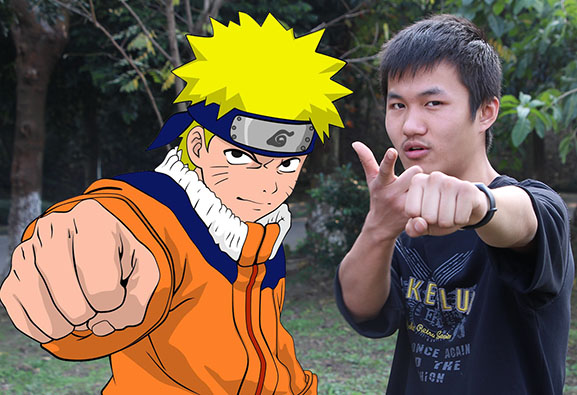

火影动漫完结了，大结局也是很喜人的。

一个时代的结束

我记得我是初中开始迷上火影的，当时已经更新了很多集了。还记得是在电脑城（数码广场）顶楼买的DVD压缩光盘。回去后本来打算随便看看，结果一看不可收拾，通宵达旦的看，甚至去亲戚家玩还带着光碟。在经历10年的追漫过程后，鸣人终于当上了火影。

火影忍者讲述了一个村子的故事，以‘木叶村’为中心塑造了形形色色人物。我最喜欢的自然是鸣人了，感觉这个人物对我的影响还是比较深的。勤奋、不放弃、积极心态、影响、改变这几点是我所学到的。

PS：也不知道是不是看了火影的缘故，我对运动、锻炼身体特别热衷，以至于冬天身边的同学开始穿棉袄了我还挂着短袖。大学期间由于奔波于各社团之间，练就一身口遁，经常给身边的朋友传递些正能量，也是人们俗称的鸡汤（其实是我内心的感悟）。

最后附上一张和鸣人的合照，愿我也当上‘火影’。

 