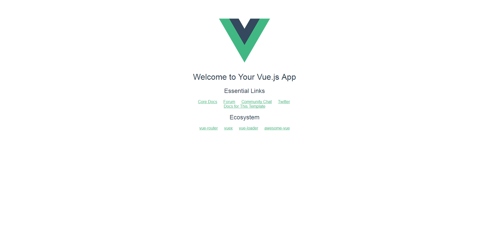

使用vue-cli写一个基于环信的web即时通讯。
<!-- more -->
# 安装node
因为需要npm来装vue-cli，所以需要先装node，没有装的同学移步[node](../node)进行安装。
# 安装vue
打开命令行输入`npm install -g vue-cli`
# 搭建vue-cli脚手架
打开命令行输入`vue init webpack vue-test`
vue-cli的配置信息：
**Project name (vue-test)**项目名称，可以自己指定，也可直接回车，按照括号中默认名字（注意这里的名字不能有大写字母，如果有会报错Sorry, name can no longer contain capital letters）。
**Project description (A Vue.js project)**项目描述，也可直接点击回车，使用默认名字。
**Author** 作者，同上。
**Vue build（Use arrow keys)**
1、**Runtime + Compiler: recommended for most users**运行+编译，推荐给大多数用户，点击回车选择。
2、**Runtime-only: about 6KB lighter min+gzip, but templates (or any Vue-specificHTML) are ONLY allowed in .vue files - render functions are required elsewhere**仅运行时，已经选择第一个了。
**Install vue-router? (Y/n)**是否安装vue-router，这是官方的路由，大多数情况下都使用。这里就输入“y”后回车即可。
**Use ESLint to lint your code? (Y/n)**是否使用ESLint管理代码，ESLint是个代码风格管理工具，是用来统一代码风格的，并不会影响整体的运行，这也是为了多人协作，新手就不用了，一般项目中都会使用。[ESLint官网](https://eslint.org/)，这里就输入“y”"n"都可以。
**Pick an ESLint preset (Use arrow keys)**选择一个ESLint预设，编写vue项目时的代码风格，因为我选择了使用ESLint。
1、**Standard (https://github.com/feross/standard)**标准，有些看不明白，什么标准呢，去给提示的standardgithub地址看一下， 原来时js的标准风格。
2、**AirBNB (https://github.com/airbnb/javascript)**JavaScript最合理的方法，这个github地址说的是JavaScript最合理的方法。
3、**none (configure it yourself)**不选择。

**Set up unit tests? (Y/n)**是否安装单元测试，我选择安装。
**Pick a test runner? (Use arrow keys)**选择自动化测试工具。
1、**Jest**Facebook开发的一个对javascript进行单元测试的工具。
2、**karma and Mocha**常用的自动化测试工具，我选它。
3、**none(configure it yourself)**不选择。
**Setup e2e tests with Nightwatch(Y/n)?**是否安装e2e测试 ，我选择安装。
**Should we run `npm install` for you after the project has been created? (recommended) (Use arrow keys)**选择用什么安装依赖包。
1、**Yes, use NPM**选择npm安装。
2、**Yes, use Yarn**选择yarn安装。
3、**No, I will handle that myself**暂时安装，自行安装。我选择这个。
基本框架搭建完成，进入vue-test目录，打开命令行，输入`npm install`开始安装所需要的依赖包。
装完后（所有依赖正常安装），输入命令`npm run dev`开始运行示例页面。默认访问127.0.0.1:8080。示例如图1：


下面来看看项目目录：
```
├── build/                      # webpack配置参数文件
│   └── ...
├── config/                     
│   ├── index.js                # 主项目的配置
│   └── ...
├── src/
│   ├── main.js                 # 应用入口
│   ├── App.vue                 # 主应用组件
│   ├── router/                 # 路由
│   │   └── index.js            # 路由配置文件
│   ├── components/             # UI组件
│   │   └── ...
│   └── assets/                 # 模块资源（webpack提供）
│       └── ...
├── static/                     # 纯静态资源（打包时直接复制）
├── test/
│   └── unit/                   # 单元测试
│   └── e2e/                    # e2e tests测试
├── .babelrc                    # babel编译参数
├── .editorconfig               # 编辑器配置
├── .eslintignore 
├── .eslintrc.js                # eslint配置文件，用以规范团队开发编码规范
├── .gitignore                  # github提交文件屏蔽的配置文件
├── .postcssrc.js
├── index.html                  # 主页模板
├── package.json                # 项目文件，记载着一些命令和依赖还有简要的项目描述信息
└── README.md
```